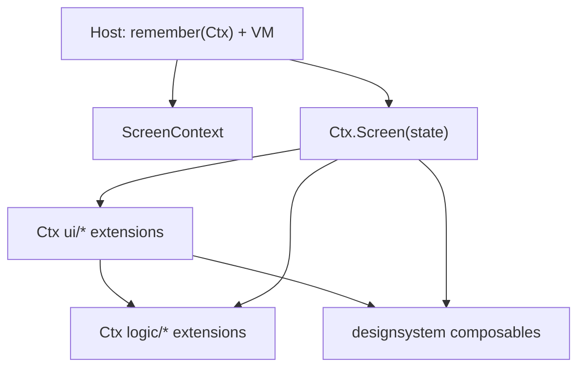

# Screen Context

Pattern for Compose feature screens that have **many on-screen components** (lists, menus, dialogs, bars). Reference implementation: `feature/files/presentation/.../browser/`.

## Why

Splitting a busy screen into **Screen (all logic)** vs **Content (all drawing)** forces every component’s callbacks through one wiring table. That is hard to review, and logic sits far from the UI it drives.

**Screen Context** keeps resources on a small context type and makes screen-specific UI and logic **extensions** of that type, so each piece of UI can call the logic it needs without a mega parameter list.

## Name

| Term | Meaning |
| --- | --- |
| **Screen Context** | The pattern |
| `*ScreenContext` | The class holding screen resources (e.g. `FileBrowserScreenContext`) |
| Host | Feature entry (`FilesScreens.FileBrowser` / `DefaultFilesScreens`) that builds the context and owns the ViewModel |

## Shape

```text
presentation/<screen>/
  <Name>ScreenContext.kt   # resources: service, updateState, exits, scope
  <Name>ViewModel.kt       # UI state types + state-only ViewModel
  <Name>Screen.kt          # Ctx.<Name>Screen(state)
  ui/                      # Ctx UI extensions (take state)
  logic/                   # Ctx logic extensions (mutations, navigate, listing)
presentation/preview/
  <Name>Previews.kt        # @Preview composables, fixtures, fakes (call real Screen)
```



## Rules

1. **Context holds resources, not UI state.** Typical members: feature service/API, `updateState`, cross-feature callbacks (`onOpenFile`, `onNavigateBack`), `CoroutineScope`. UI state lives in the ViewModel / `UiState` and is passed as `state`. Mutable slots that must survive recomposition (e.g. a debounced job) live as `var` fields on the context instance.
2. **Screen-specific composables are context extensions** and take **`state`** so recomposition stays correct:
   `FileBrowserScreenContext.FileBrowserBody(state: FileBrowserUiState)`.
3. **Screen-specific logic is context extensions** under `logic/` (no nested `fun` inside composables).
4. **Design-system / shared UI stays parameterized** — not context extensions.
5. **Host owns the ViewModel and remembers the context.** Construct `*ScreenContext` with `remember(…keys)` in the host (and in preview hosts). Key every dependency the context closes over (`viewModel`, services, exit lambdas, etc.) so the instance is stable across recomposition but rebuilt when those inputs change. Do not allocate a fresh context on every composition — that drops any `var` fields on the context and wastes work.
6. **`updateState` must apply to the flow’s current value** (`updater(it)`), never a composition-captured snapshot.
7. **Previews:** `@Preview` composables, fixtures, and fakes live in the module’s `presentation/preview/` package and call the **real** Screen/Content (no duplicated fake screens in `:designsystem`; no `@Preview` on Screen/Content files). Preview hosts also `remember` the context.
8. **No nested function declarations** (same as the rest of feature structure).

## When to use

| Use Screen Context | Prefer thin screen (same shape, no Context class) |
| --- | --- |
| Many components (list + menus + dialogs + bars) | One form, Connect flow, Settings hub / section |
| Logic naturally belongs next to each UI piece | Same split into `ui/` + `logic/`, but top-level functions |
| File browser–scale screens | Still: ViewModel + Screen + Previews — **not** a mega `*Content` callback table |

Thin screens should still look like Screen Context on disk (`ViewModel`, `Screen`, `ui/`, `logic/`, plus `presentation/preview/*Previews.kt` for `@Preview`) — omit only the `*ScreenContext` type. See `/structure-feature-code` → *Thin screens*.

Do **not** collapse a thin screen into one `*Content` with every `onClick` in the signature.

## Anti-patterns

- Reintroducing a `*Content` that takes dozens of lambdas.
- Putting service calls or navigation exits only in the ViewModel (unless explicitly changing that rule).
- Context extensions for design-system components.
- Omitting `state` from a context UI composable (breaks targeted recomposition).
- Constructing `*ScreenContext` without `remember` in the host (new instance every recomposition).
- `remember`ing a context **without** keying unstable callbacks / services — stale exits or wrong dependencies. Prefer `remember(viewModel, service, onNavigateBack, …) { … }`.

## Checklist

- [ ] `*ScreenContext` holds resources only
- [ ] Host builds context with `remember(…keys)` + VM; screen is `Ctx.Screen(state)`
- [ ] Screen-specific UI under `ui/` as context extensions with `state`
- [ ] Logic under `logic/` as context extensions
- [ ] Designsystem stays normal parameters
- [ ] Previews: `@Preview` + fixtures in `presentation/preview/` only; preview host `remember`s context; no product screens in `:designsystem`
- [ ] No nested `fun`; no mega callback Content
