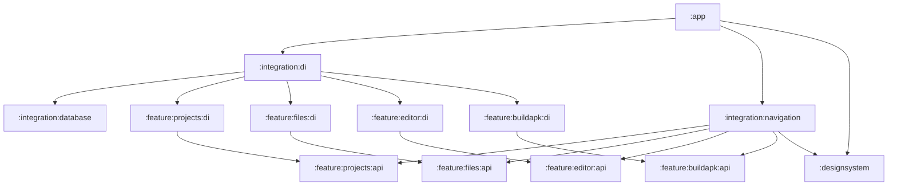
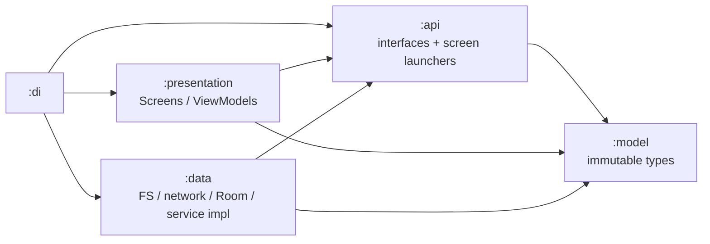
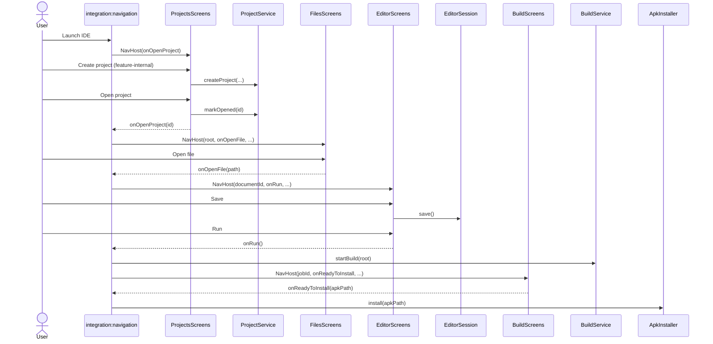
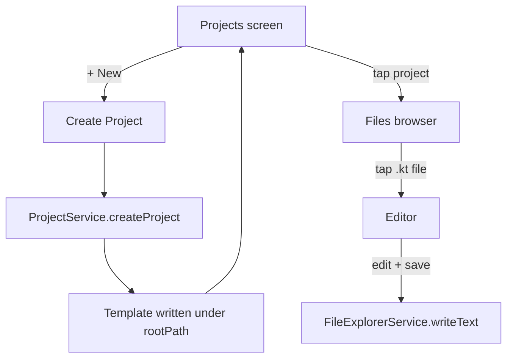
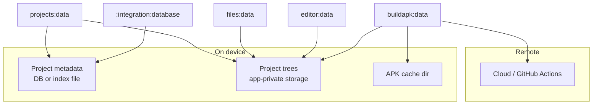

# Android Studio Lite — Architecture (v0.1)

> Module map and contracts for Android Studio Lite v0.1.  
> Sources: `project/requierments.md`, Figma (`Android-Studio-Lite`), existing `:designsystem`.

---

## 1. Product snapshot

**Android Studio Lite** is a native Kotlin / Jetpack Compose IDE that runs on the phone:


| Capability                                                  | v0.1               |
| ----------------------------------------------------------- | ------------------ |
| Create Android project (single Activity + Compose template) | Yes                |
| List / open projects                                        | Yes                |
| Browse & manage project files/folders                       | Yes                |
| Edit source files                                           | Yes (basic editor) |
| Build APK via cloud / GitHub Actions (or equivalent)        | Yes                |
| Download APK → system install screen                        | Yes                |
| Edit → rebuild → reinstall loop                             | Yes                |


**Later:** Git, AI assistant, syntax highlighting.

**UI source of truth:** [Figma — Android Studio Lite](https://www.figma.com/design/M2LGyXHC5YYJekr3Fq3oiP/Android-Studio-Lite)

Known Figma pages (from prior work):

- **Main Screens** — Projects, Create Project, File Browser, Editor, Run/Build
- **file management flows** — create / rename / move / delete / copy / conflicts / sandbox rules
- **Loading & error states** — loading / failure UI for Projects, Create, Files, Editor, Build ([open](https://www.figma.com/design/M2LGyXHC5YYJekr3Fq3oiP/Android-Studio-Lite?node-id=90-2))
- **Architecture** — module dependency flowchart + create→edit→run product flow ([open](https://www.figma.com/design/M2LGyXHC5YYJekr3Fq3oiP/Android-Studio-Lite?node-id=59-2))

Existing foundation: `:designsystem` (colors, typography, shared Compose primitives); `:core:error` (`AppException` for planned UI messages).

---


## 2. Architectural goals

1. **Capability modules are self-contained** — each owns its data + presentation for its domain.
2. **Public surface is thin** — outside consumers see **interfaces + immutable data types only**, never implementations.
3. **Integration modules wire capabilities** — they do not invent domain logic; they compose APIs into product flows.
4. `:app` **stays thin** — Application class, start Koin, host `IdeNavHost`, permissions, install intents.
5. **Replaceable backends** — especially Build (GHA today, other cloud later) behind one interface.
6. **Safe file sandbox** — all file ops stay under a project root (`projectDir`).

---


## 3. Module map

```text
AndroidStudioLite/
├── app                         # shell: start Koin, permissions, install
├── designsystem                # tokens + UI primitives
├── core/
│   └── error                   # AppException + UI message helper (not domain models)
├── feature/
│   ├── projects/
│   │   ├── model               # Project, ProjectId, CreateProjectRequest
│   │   ├── api                 # ProjectService + ProjectsScreens
│   │   ├── data                # Room entities/DAOs + service impl
│   │   ├── presentation        # Compose screens
│   │   └── di                  # feature Koin module
│   ├── files/                  # model / api / data / presentation / di
│   ├── editor/                 # model / api / data / presentation / di
│   └── buildapk/               # model / api / data / presentation / di
└── integration/
    ├── database                # RoomDatabase assembly (wires feature entities/DAOs)
    ├── di                      # aggregates feature + database Koin modules
    └── navigation              # IDE NavHost / product navigation graph
```


### Why split `model` / `api` / `data` / `presentation` / `di`?

| Module | Owns |
| --- | --- |
| `:model` | Feature data classes / value types |
| `:api` | Interfaces only (`*Service`, `*Screens`) — depends on `:model` |
| `:data` | Persistence & domain impl (entities, DAOs, FS, repositories) |
| `:presentation` | Compose UI implementing screen launchers |
| `:di` | Feature Koin module binding api ← data/presentation |

Outside a feature, consumers depend on **`:api` (+ `:model` as needed)**. `:integration:di` pulls feature `:di` modules; `:integration:navigation` composes screen launchers; `:integration:database` assembles Room from feature `:data` entities/DAOs — it does not own feature schemas.

```text
:feature:projects:model         →  Project, ProjectId, …
:feature:projects:api           →  ProjectService, ProjectsScreens
:feature:projects:data          →  ProjectEntity, ProjectDao, ProjectService impl
:feature:projects:presentation  →  ProjectsScreens impl
:feature:projects:di            →  projectsDiModule
:integration:database           →  AslDatabase (entities from feature data modules)
:integration:di                 →  integrationDiModule (includes feature + database modules)
:integration:navigation         →  IdeNavHost (switches between feature NavHosts)
:app                            →  startKoin(integrationDiModule) + host IdeNavHost
```

---


## 4. Dependency rules


### Allowed direction




### Hard rules


| Rule                                                                         | Reason                                                    |
| ---------------------------------------------------------------------------- | --------------------------------------------------------- |
| `*:api` must not depend on `:data` / `:presentation` / `:di`                 | Keeps public surface pure                                 |
| Feature `:data` / `:presentation` must not depend on other features’ internals | Avoid spaghetti; talk via APIs or integration           |
| Feature modules should not depend on other feature `:api`s unless unavoidable | Prefer `:integration:navigation` / `:integration:di` for cross-feature orchestration |
| Only `:app` / `:integration:navigation` compose multiple features            | Clear ownership of product flows                          |
| `:designsystem` depends on nothing in `feature/`                             | UI kit stays reusable                                     |
| `:integration:di` owns Koin aggregation; `:integration:navigation` owns nav  | Separate wiring concerns                                  |


---


## 5. Layering inside a capability module

Each feature is five Gradle modules with the same shape:

```text
feature/files/
  model/          # FsNode, ProjectRoot, DirectoryListing
  api/            # FileExplorerService, FilesScreens
  data/           # FS / Room / service implementations
  presentation/   # Compose screens, ViewModels
  di/             # Koin bindings (api ← data/presentation)
```




**Outside the feature**, only `:api` (+ `:model` as needed) is visible. The API should provide an interface to open screens (screen launchers), instead of leaking ViewModels or internal presentation logic.

---

## 6. Capability contracts (public APIs)

These are **design sketches** — names can change; the shape is what matters.

### 6.1 Projects — `:feature:projects:api`

**Owns:** project identity, metadata, create-from-template, open/delete/list.

```kotlin
// Conceptual — not implemented yet

data class ProjectId(val value: String)
data class Project(
    val id: ProjectId,
    val name: String,
    val packageName: String,
    val rootPath: String,          // absolute sandbox root
    val lastOpenedAt: Long?,
)

data class CreateProjectRequest(
    val name: String,
    val packageName: String,
    val minSdk: Int = 26,
)

interface ProjectService {
    fun observeProjects(): Flow<List<Project>>
    suspend fun getProject(id: ProjectId): Project?
    suspend fun createProject(request: CreateProjectRequest): Project
    suspend fun deleteProject(id: ProjectId)
    suspend fun markOpened(id: ProjectId)
}

/**
 * Feature UI surface. Integration calls [NavHost] only; list ↔ create is owned here.
 * Individual screens stay available for previews / tests.
 */
interface ProjectsScreens {
    @Composable
    fun NavHost(onOpenProject: (projectId: ProjectId) -> Unit)

    @Composable
    fun ProjectsList(
        onOpenProject: (projectId: ProjectId) -> Unit,
        onCreateProject: () -> Unit,
    )

    @Composable
    fun CreateProject(
        onCreated: (projectId: ProjectId) -> Unit,
        onCancel: () -> Unit,
    )
}
```

**UI owned by** `:presentation`**:** Projects list, Create Project dialog/screen (Figma Main Screens) — reached only via `ProjectsScreens.NavHost` (feature sub-navigation).

**Does not own:** browsing files inside a project (that’s Files).

---


### 6.2 Files — `:feature:files:api`

**Owns:** navigation + CRUD under a project root. Matches Figma **file management flows**.

```kotlin
data class ProjectRoot(val absolutePath: String)

sealed class FsNode {
    abstract val name: String
    abstract val relativePath: String
    data class File(...) : FsNode()
    data class Folder(...) : FsNode()
}

data class DirectoryListing(
    val currentRelativePath: String,
    val entries: List<FsNode>,
)

interface FileExplorerService {
    fun observeListing(root: ProjectRoot, relativePath: String): Flow<DirectoryListing>

    suspend fun createFile(root: ProjectRoot, parentRelative: String, name: String): FsNode.File
    suspend fun createFolder(root: ProjectRoot, parentRelative: String, name: String): FsNode.Folder
    suspend fun rename(root: ProjectRoot, relativePath: String, newName: String): FsNode
    suspend fun move(root: ProjectRoot, fromRelative: String, toParentRelative: String): FsNode
    suspend fun copy(root: ProjectRoot, fromRelative: String, toParentRelative: String): FsNode
    suspend fun delete(root: ProjectRoot, relativePath: String)

    suspend fun readText(root: ProjectRoot, relativePath: String): String
    suspend fun writeText(root: ProjectRoot, relativePath: String, content: String)
}

/**
 * Screen launcher — file browser / management UI for a project root.
 * Cross-feature exits (open file → editor) are callbacks wired by integration.
 */
interface FilesScreens {
    @Composable
    fun NavHost(
        root: ProjectRoot,
        projectName: String,
        initialRelativePath: String,
        onOpenFile: (relativePath: String) -> Unit,
        onNavigateBack: () -> Unit,
    )

    @Composable
    fun FileBrowser(
        root: ProjectRoot,
        projectName: String,
        initialRelativePath: String,
        onOpenFile: (relativePath: String) -> Unit,
        onNavigateBack: () -> Unit,
    )
}
```

**UI owned by** `:presentation`**:** path bar, folder/file rows, create/rename/move/delete dialogs, empty states, context menus — using `:designsystem` components (`PathBar`, `FileRow`, `DialogForm`, …). Reached only via `FilesScreens.NavHost` (feature sub-navigation).

**Shared UI state model (from Figma notes):**

```text
currentPath + selectedItem + clipboard{cut|copy, path}
create / paste always target currentPath
all ops clamped to projectDir
```

---


### 6.3 Editor — `:feature:editor:api`

**Owns:** open document, dirty flag, save. Kept separate so Files stays about tree ops, not editing UX.

```kotlin
data class DocumentId(val projectId: ProjectId, val relativePath: String)

data class OpenDocument(
    val id: DocumentId,
    val content: String,
    val isDirty: Boolean,
)

interface EditorSession {
    val document: StateFlow<OpenDocument?>
    fun open(id: DocumentId, initialContent: String)
    fun updateContent(content: String)
    fun markSaved(content: String)
    fun close()
}

interface DocumentStore {
    suspend fun load(root: ProjectRoot, relativePath: String): String
    suspend fun save(root: ProjectRoot, relativePath: String, content: String)
}

/**
 * Screen launcher — editor UI for an open document.
 * Save / Run / close are callbacks or session ops; integration wires Run → Build.
 */
interface EditorScreens {
    @Composable
    fun NavHost(
        documentId: DocumentId,
        onNavigateBack: () -> Unit,
        onRun: (() -> Unit)?,
    )

    @Composable
    fun Editor(
        documentId: DocumentId,
        onNavigateBack: () -> Unit,
        onRun: (() -> Unit)?,
    )
}
```

`DocumentStore` may be implemented by adapting `FileExplorerService.readText/writeText` inside `editor:data` or via a binding in `:integration:di`. Prefer **adapter in integration** so `editor` does not hard-depend on `files:api` if we want maximum isolation — or allow a soft `editor:data → files:api` dependency for pragmatism in v0.1.

**Recommendation for v0.1:** `editor:data` may depend on `files:api` for load/save. Integration still owns cross-feature navigation and calls feature `NavHost`s — never feature presentation types.

---


### 6.4 Build APK — `:feature:buildapk:api`

**Owns:** remote build lifecycle + APK delivery. Clear, swappable interface.

```kotlin
data class BuildRequest(
    val projectId: ProjectId,
    val projectRoot: ProjectRoot,
    val projectName: String,
    val packageName: String,
)

enum class BuildPhase {
    Queued, Uploading, Building, Downloading, ReadyToInstall, Failed, Cancelled
}

data class BuildProgress(
    val jobId: String,
    val phase: BuildPhase,
    val message: String? = null,
    val apkLocalPath: String? = null,   // set when ReadyToInstall
    val error: String? = null,
)

interface BuildService {
    fun observeBuild(jobId: String): Flow<BuildProgress>
    suspend fun startBuild(request: BuildRequest): String   // returns jobId
    suspend fun cancelBuild(jobId: String)
}

/** Side-effect at the Android boundary — usually implemented in :app or buildapk:data / :integration:database */
interface ApkInstaller {
    fun requestInstall(apkLocalPath: String)
}

/**
 * Screen launcher — build progress / result UI.
 * Install hand-off uses ApkInstaller (often bound in :app).
 */
interface BuildScreens {
    @Composable
    fun NavHost(
        jobId: String,
        onReadyToInstall: (apkLocalPath: String) -> Unit,
        onDismiss: () -> Unit,
        onRetry: (() -> Unit)?,
    )

    @Composable
    fun BuildProgress(
        jobId: String,
        onReadyToInstall: (apkLocalPath: String) -> Unit,
        onDismiss: () -> Unit,
        onRetry: (() -> Unit)?,
    )
}
```

**UI owned by** `:presentation`**:** Run button states, progress sheet/screen, failure toast (Figma Run/Build) — reached only via `BuildScreens.NavHost` (feature sub-navigation).

**Data details (hidden in `:data`):** zip/upload project, trigger GHA/cloud, poll status, download artifact, write to cache dir. Swap provider without touching Projects/Files.

---

### 6.5 Screen-launcher rule (all feature `:api`s)

Every capability `:api` exposes **two** public surfaces:

| Surface | Examples | Purpose |
|---|---|---|
| Domain services | `ProjectService`, `FileExplorerService`, `BuildService` | Data / use-cases |
| Screen launchers | `ProjectsScreens`, `FilesScreens`, … | Feature UI; each exposes `NavHost` for internal routes |

**Rules:**

1. Launchers live in `:api` and are implemented in `:presentation` (bound via `:di`).
2. **Feature sub-navigation** (e.g. projects list ↔ create) lives inside the feature’s `NavHost`. Integration does not own those routes.
3. Launchers accept **callbacks** for exits that leave the feature (open project → files, open file → editor, run → build). `:integration:navigation` wires those callbacks between feature `NavHost`s.
4. Launchers must not return or expose ViewModels, repositories, or other `:data` / `:presentation` types.
5. `:integration:navigation` / `:app` depend on launcher interfaces from `:api` only — never on feature screen classes in `:presentation`.

---


## 7. Integration modules — `:integration:di` + `:integration:navigation`

These are **not domain specialists** — they **connect** specialists into product behavior.

### `:integration:di`

- Aggregates per-feature Koin modules + `:integration:database`
- `:app` starts Koin with `integrationDiModule` only

### `:integration:navigation`

- Cross-feature IDE graph (`IdeNavHost`) — switches between feature `NavHost`s
- Does **not** implement feature-internal routes (list ↔ create, etc.)
- Wires exit callbacks between features (open project → files, open file → editor, run → build)
- Providing the root entry consumed by `:app`


### Does **not**

- Implement filesystem algorithms
- Talk to GitHub Actions directly
- Own design tokens
- Duplicate project metadata storage




### Suggested façade (deferred past v0.1)

`IdeCoordinator` (command façade for open project / open file / run) is **optional and deferred**.  
v0.1 uses the **nav graph + screen-launcher callbacks** only. Revisit if a second entry point (deep link, notification, widget) appears.

```kotlin
// Deferred — not required for v0.1
interface IdeCoordinator {
    fun openProjects()
    fun openProject(id: ProjectId)
    fun openFile(projectId: ProjectId, relativePath: String)
    fun runProject(id: ProjectId)
}
```

---


## 8. App shell — `:app`


| Concern                                               | Owner                          |
| ----------------------------------------------------- | ------------------------------ |
| Start Koin with `integrationDiModule`                 | `:app`                         |
| Per-feature Koin modules (`api` ← data/presentation)  | each `:feature:*:di`           |
| Aggregate feature + database Koin modules             | `:integration:di`              |
| IDE `NavHost` / nav graph                             | `:integration:navigation`      |
| Host Activity that embeds the IDE graph               | `:app`                         |
| `REQUEST_INSTALL_PACKAGES` / install activity result  | `:app` (+ `ApkInstaller` impl) |
| Application / MainActivity                            | `:app`                         |
| Theme wrapper using `:designsystem`                   | `:app`                         |


`:app` starts Koin via `:integration:di`; UI composition goes through `:integration:navigation` routes and screen launchers.

---


## 9. Design system — `:designsystem`

Already present. Role stays:

- `AslColors`, `AslTypography`, `AslIcons`
- Primitives: buttons, text fields, dialogs, file/folder rows, path bar, project card, menus, toasts, top/status bars

**Rule:** feature UIs compose these; they do not redefine tokens. Feature-specific layouts live in feature `:presentation`, not in the design system (unless a pattern is reused 3+ times).

---


## 10. End-to-end product flows


### 10.1 Create → open → edit → save




### 10.2 File management (Figma coverage → API)


| Figma case                     | API / behavior                                 |
| ------------------------------ | ---------------------------------------------- |
| Create file / folder           | `createFile` / `createFolder` at `currentPath` |
| Nested create                  | navigate first → create at new `currentPath`   |
| Rename                         | `rename`                                       |
| Delete file / non-empty folder | `delete` (+ confirm UI)                        |
| Move / copy                    | `move` / `copy`                                |
| Name conflict / invalid name   | throw / catch → UI message                     |
| Breadcrumbs / up               | listing `relativePath` changes                 |
| Open → editor → save           | `:integration:navigation` + Editor + `writeText` |
| Empty folder                   | empty state UI                                 |
| Invalid move into self/child   | throw / catch → UI message                     |
| Delete/move while open         | navigation closes or prompts EditorSession     |
| Sandbox guardrails             | throw / catch → UI message                     |


---


## 11. Data ownership




- **Projects** create the root folder + template + metadata row.
- **Files / Editor** mutate files under that root only.
- **Build** reads the tree for upload; writes APK only to cache; never mutates source as part of build.

---


## 12. Gradle include sketch

```kotlin
// settings.gradle.kts
include(":app")
include(":designsystem")
include(":core:error")

include(":feature:projects:model")
include(":feature:projects:api")
include(":feature:projects:data")
include(":feature:projects:presentation")
include(":feature:projects:di")
// … same five modules for files, editor, buildapk

include(":integration:database")
include(":integration:di")
include(":integration:navigation")
```

---


## 13. What stays out of v0.1 modules


| Later feature        | Likely module                                              |
| -------------------- | ---------------------------------------------------------- |
| Git push/pull/commit | `:feature:git` (model / api / data / presentation / di)    |
| AI assistant         | `:feature:assistant` (same five-way split)                 |
| Syntax highlighting  | enhance `:feature:editor` (or `:feature:editor:highlight`) |


Integration grows new edges; existing APIs stay stable.

---


## 14. Implementation decisions

Resolved in grilling; recorded in **`project/v0.1-implementation-plan.md`** (and GitHub issue #5).  
Do **not** expand this architecture doc with ephemeral impl details (timings, asset paths, test matrix, etc.).

High-level locks that affect module shape:

- **Koin** — per-feature `:di` modules; `:integration:di` includes them; `:app` starts Koin
- **App-private** project storage; **Room** assembled in **`:integration:database`**; feature tables/DAOs live in **`:feature:*:data`**
- **Models per feature** (`:feature:*:model`) — no shared core *domain* model module
- **`:core:error`** — shared `AppException(uiMessage)` for planned user-facing failures; unexpected errors are logged and must not show `Throwable.message`
- **`editor:data` may use `files:api`** for load/save
- **Fake `BuildService`** for v0.1 (real GitHub Actions later, same API)
- **IDE nav graph** in `:integration:navigation` (no `IdeCoordinator` in v0.1)

---


## 15. Summary


| Module              | Role                   | Public surface                                      |
| ------------------- | ---------------------- | --------------------------------------------------- |
| `:designsystem`     | Visual language        | Compose components + tokens                         |
| `:core:error`       | Planned failures       | `AppException` + `userMessageOrNull`                |
| `:feature:projects` | Project lifecycle | `model` + `api` + `data` + `presentation` + `di` |
| `:feature:files` | Tree navigation & CRUD | same five-way split |
| `:feature:editor` | Edit / dirty / save | same five-way split |
| `:feature:buildapk` | Remote APK pipeline | same five-way split |
| `:integration:database` | Room assembly | Wires feature entities/DAOs into `AslDatabase` |
| `:integration:di` | DI aggregation | Includes feature + database Koin modules |
| `:integration:navigation` | Product nav | IDE `NavHost` + screen-launcher wiring |
| `:app` | Host | Start Koin + permissions/install |


This matches the intended shape: **specialist capability modules** with clean interfaces, plus **integration modules** that assemble them into Android Studio Lite — without leaking implementations across boundaries.