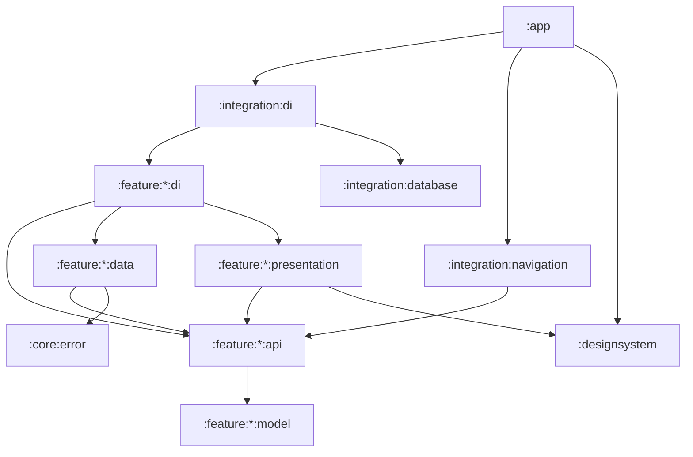

# Android Studio Lite — Architecture (v0.1)

Concise module map for agents and humans. **Source of truth for APIs and models is the code** (`:feature:*:api` / `:model`), not this file. UI contract: [Figma](https://www.figma.com/design/M2LGyXHC5YYJekr3Fq3oiP/Android-Studio-Lite). Related: `project/progress.md`, `project/requierments.md`, `docs/agents/project-overview.md`.

---

## 1. Product snapshot

On-device Kotlin / Jetpack Compose IDE:

| Capability | v0.1 |
| --- | --- |
| Create / list / open / delete projects (Compose template) | Yes |
| Browse & manage files under project root (sandboxed) | Yes |
| Edit source files (basic editor) | Yes |
| Run → build progress → install APK | Yes (**fake** local build + bundled demo APK today) |
| Edit → rebuild → reinstall loop | Yes (same fake path) |

**Not in v0.1:** real cloud/GHA Gradle (tracked in [`cloud-build-prd.md`](cloud-build-prd.md) / issues #19–#25), Git, AI assistant, syntax highlighting.

Foundation: `:designsystem`, `:core:error` (`AppException`).

---

## 2. Goals

1. **Capability modules are self-contained** — each owns data + presentation for its domain.
2. **Public surface is thin** — outside a feature, depend on `:api` (+ `:model` as needed), never `:data` / `:presentation`.
3. **Integration wires only** — no domain logic in `:integration:*` or `:app`.
4. **`:app` stays thin** — Application, Koin start, `IdeNavHost`, permissions, install intents.
5. **Replaceable build backend** — one `BuildService` API; fake today, real cloud later.
6. **Safe file sandbox** — file ops stay under the project root.

---

## 3. Module map

```text
app                         # Koin, MainActivity, IdeNavHost host, install permission
designsystem                # tokens + shared Compose primitives
core/error                  # AppException + userMessageOrNull
feature/
  projects/   model · api · data · presentation · di
  files/      model · api · data · presentation · di
  editor/     model · api · data · presentation · di
  buildapk/   model · api · data · presentation · di
  auth/       model · api · data · presentation · di   # session + Connect account
  github/     api · data · di                          # stateless GitHub helpers
integration/
  database                  # Room assembly (feature entities/DAOs)
  di                        # aggregates feature + database Koin modules
  navigation                # IdeNavHost — cross-feature routes only
```

Full include list: `settings.gradle.kts`.

| Slice | Owns |
| --- | --- |
| `:model` | Immutable types / IDs |
| `:api` | Service + `*Screens` interfaces |
| `:data` | Persistence / FS / service impl |
| `:presentation` | Compose UI (+ Screen Context for busy screens) |
| `:di` | Feature Koin bindings |

---

## 4. Dependency rules



**Hard rules**

- Outside a feature: **`:api` / `:model` only**.
- `:integration:navigation` only wires **cross-feature** exits; feature-internal routes stay in each feature’s `*Screens`.
- `:editor:data` may depend on `:files:api` (document load/save through the file explorer).
- No feature → feature `:data` / `:presentation` edges.

---

## 5. Features (roles, not APIs)

### Projects
- Metadata in Room; project trees under app-private storage; scaffolds an empty Compose template.
- UI: list ↔ create (internal nav).
- Exits: open → Files; run → Build (can skip Files/Editor).

### Files
- Sandboxed FS under project root (`SandboxPaths`).
- UI: file browser (Screen Context).
- Exits: open file → Editor; run → Build; back → Projects.

### Editor
- In-memory session; persist via `:files:api`; auto-save preference.
- UI: editor screen (Screen Context).
- Exits: back → Files; run → Build.

### Build (`buildapk`)
- `BuildService` + `ApkInstaller` in `:api`.
- **Current data:** `FakeBuildService` (timed phases) + bundled `demo-sample.apk` — not GitHub Actions.
- UI: start → progress; on ready, nav asks installer to open the system install flow.
- Future: swap impl behind the same `BuildService` without changing UI contracts.

Busy-screen layout: `docs/agents/screen-context.md`. Feature conventions: `/structure-feature-code`.

---

## 6. Integration & app shell

| Module | Role |
| --- | --- |
| `:integration:database` | `AslDatabase` — today projects entity/DAO only |
| `:integration:di` | `integrationDiModule` — only module `:app` starts |
| `:integration:navigation` | `IdeNavHost` — `Projects` / `Files` / `Editor` / `Build` + return targets; closes editor if project deleted |
| `:app` | `AslApplication`, `MainActivity`, theme bridge, FileProvider / install permission |

```text
Projects
  ├─ open ──► Files ─┬─ open file ──► Editor ──► Build (return Editor)
  │                  └─ run ───────────────────► Build (return Files)
  └─ run ──────────────────────────────────────► Build (return Projects)
Build ──► ApkInstaller (system UI) ; dismiss ──► returnTo
```

---

## 7. Data ownership

| Data | Where |
| --- | --- |
| Project metadata | Room via `:feature:projects:data` |
| Project files | App-private FS; CRUD via `:feature:files:data` |
| Editor buffer | Memory in `:feature:editor:data`; disk via files API |
| Build artifacts | Local cache + demo asset in `:feature:buildapk:data` |
| Auth session | SharedPreferences in `:feature:auth:data` (stub device flow) |
| Remote CI | **None yet** (real GHA = `#25`) |

---

## 8. Out of scope / later

Git, AI assistant, syntax highlighting, real cloud/GHA Gradle (same `BuildService` surface), Documents storage, Gradle wrappers in generated projects.

Locked product decisions: `project/v0.1-implementation-plan.md` (and grilling notes under `project/` when relevant).

---

## 9. Summary

| Area | Public surface | Impl notes |
| --- | --- | --- |
| Projects | `:feature:projects:api` | Room + template FS |
| Files | `:feature:files:api` | Sandboxed FS |
| Editor | `:feature:editor:api` | Session + files API |
| Build | `:feature:buildapk:api` | Fake service + demo APK |
| Nav / DI / DB | `:integration:*` | Wire only |
| UI kit / errors | `:designsystem`, `:core:error` | Shared |
