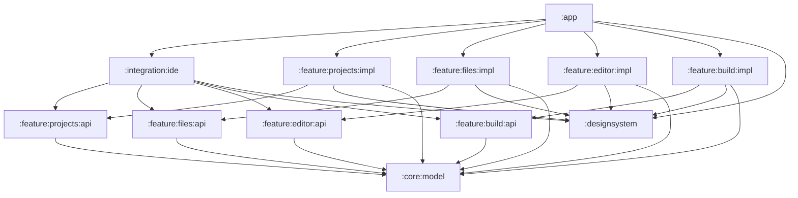
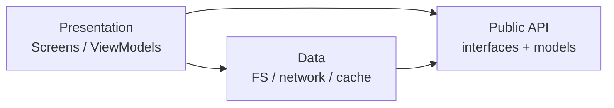
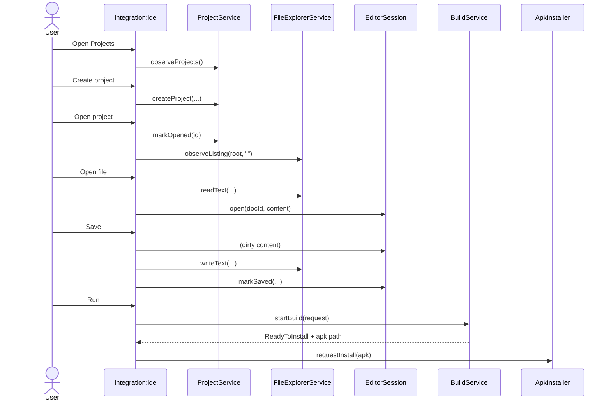
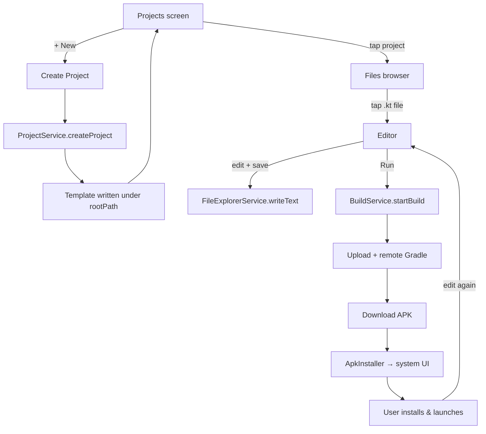
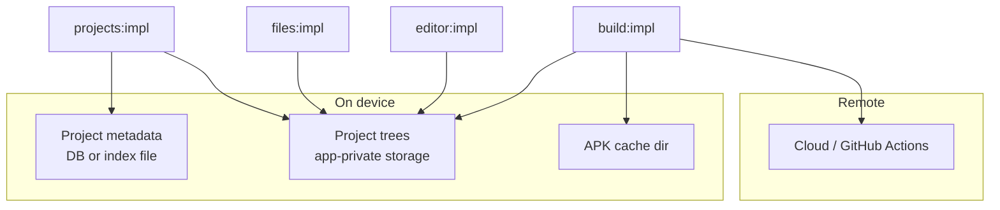

# Android Studio Lite — Architecture (v0.1)

> Design-only document. No implementation yet.  
> Sources: `project/requierments.md`, Figma (`Android-Studio-Lite`), existing `:designsystem`.

---

## 1. Product snapshot

**Android Studio Lite** is a native Kotlin / Jetpack Compose IDE that runs on the phone:

| Capability | v0.1 |
|---|---|
| Create Android project (single Activity + Compose template) | Yes |
| List / open projects | Yes |
| Browse & manage project files/folders | Yes |
| Edit source files | Yes (basic editor) |
| Build APK via cloud / GitHub Actions (or equivalent) | Yes |
| Download APK → system install screen | Yes |
| Edit → rebuild → reinstall loop | Yes |

**Later:** Git, AI assistant, syntax highlighting.

**UI source of truth:** [Figma — Android Studio Lite](https://www.figma.com/design/M2LGyXHC5YYJekr3Fq3oiP/Android-Studio-Lite)

Known Figma pages (from prior work):

- **Main Screens** — Projects, Create Project, File Browser, Editor, Run/Build
- **file management flows** — create / rename / move / delete / copy / conflicts / sandbox rules
- **Architecture** — module dependency flowchart + create→edit→run product flow ([open](https://www.figma.com/design/M2LGyXHC5YYJekr3Fq3oiP/Android-Studio-Lite?node-id=59-2))

Existing foundation: `:designsystem` (colors, typography, shared Compose primitives).

---

## 2. Architectural goals

1. **Capability modules are self-contained** — each owns its data + presentation for its domain.
2. **Public surface is thin** — outside consumers see **interfaces + immutable data types only**, never implementations.
3. **Integration modules wire capabilities** — they do not invent domain logic; they compose APIs into product flows.
4. **`:app` stays thin** — Application class, DI graph, root navigation host, permissions, install intents.
5. **Replaceable backends** — especially Build (GHA today, other cloud later) behind one interface.
6. **Safe file sandbox** — all file ops stay under a project root (`projectDir`).

---

## 3. Module map

```text
AndroidStudioLite/
├── app                         # shell: DI, nav host, permissions
├── designsystem                # tokens + UI primitives (exists)
├── core/
│   └── model                   # tiny shared types (Path, Result, Ids) — optional but recommended
├── feature/
│   ├── projects/
│   │   ├── api                 # ProjectService + models
│   │   └── impl                # data + UI for projects
│   ├── files/
│   │   ├── api                 # FileExplorerService + models
│   │   └── impl                # data + UI for file management
│   ├── editor/
│   │   ├── api                 # EditorSession / DocumentStore
│   │   └── impl                # editor screen + dirty/save
│   └── build/
│       ├── api                 # BuildService + models
│       └── impl                # upload → remote build → download → install
└── integration/
    └── ide                     # wires Projects → Files → Editor → Build into one graph
```

### Why `api` / `impl` pairs?

Gradle consumers depend on **`:feature:X:api`**. Implementations live in **`:feature:X:impl`** and are only pulled by `:app` / `:integration:ide`. That enforces “interfaces and types only” at the module boundary.

```text
:feature:projects:api   →  interfaces + data classes
:feature:projects:impl  →  Room/FS, ViewModels, Composables  (depends on :api + :designsystem)
```

---

## 4. Dependency rules

### Allowed direction



### Hard rules

| Rule | Reason |
|---|---|
| `*:api` must not depend on `*:impl` | Keeps public surface pure |
| Feature `impl`s must not depend on other feature `impl`s | Avoid spaghetti; talk via APIs or integration |
| Feature `impl`s should not depend on other feature `api`s unless unavoidable | Prefer integration module for cross-feature orchestration |
| Only `:app` / `:integration:ide` compose multiple features | Clear ownership of product flows |
| `:designsystem` depends on nothing in `feature/` | UI kit stays reusable |

---

## 5. Layering inside a capability module

Each `impl` follows the same internal shape:

```text
feature/files/impl/
  ui/           # Compose screens, ViewModels (presentation)
  domain/       # use-cases (optional if thin) — still internal
  data/         # FileSystemDataSource, repositories
```



**Outside the module**, only `API` is visible. Presentation can be launched via a **navigation entry** exposed by the integration module (or a small `FilesEntry` interface), not by leaking ViewModels.

---

## 6. Capability contracts (public APIs)

These are **design sketches** — names can change; the shape is what matters.

### 6.1 Projects — `:feature:projects:api`

**Owns:** project identity, metadata, create-from-template, open/delete/list.

```kotlin
// Conceptual — not implemented yet

data class ProjectId(val value: String)
data class Project(
    val id: ProjectId,
    val name: String,
    val packageName: String,
    val rootPath: String,          // absolute sandbox root
    val lastOpenedAt: Long?,
)

data class CreateProjectRequest(
    val name: String,
    val packageName: String,
)

interface ProjectService {
    suspend fun getProject(id: ProjectId): Project?
    suspend fun createProject(request: CreateProjectRequest): Project
    suspend fun deleteProject(id: ProjectId)
    suspend fun markOpened(id: ProjectId)
}
```

**UI owned by `impl`:** Projects list, Create Project dialog/screen (Figma Main Screens).

**Does not own:** browsing files inside a project (that’s Files).

---

### 6.2 Files — `:feature:files:api`

**Owns:** navigation + CRUD under a project root. Matches Figma **file management flows**.

```kotlin
data class ProjectRoot(val absolutePath: String)

sealed class FsNode {
    abstract val name: String
    abstract val relativePath: String
    data class File(...) : FsNode()
    data class Folder(...) : FsNode()
}

data class DirectoryListing(
    val currentRelativePath: String,
    val entries: List<FsNode>,
)

sealed class FileOpError {
    data object OutsideSandbox : FileOpError()
    data object NameConflict : FileOpError()
    data object InvalidName : FileOpError()
    data object InvalidMove : FileOpError()   // into self/child
    data class Io(val message: String) : FileOpError()
}

interface FileExplorerService {
    fun observeListing(root: ProjectRoot, relativePath: String): Flow<DirectoryListing>

    suspend fun createFile(root: ProjectRoot, parentRelative: String, name: String): Result<FsNode.File, FileOpError>
    suspend fun createFolder(root: ProjectRoot, parentRelative: String, name: String): Result<FsNode.Folder, FileOpError>
    suspend fun rename(root: ProjectRoot, relativePath: String, newName: String): Result<FsNode, FileOpError>
    suspend fun move(root: ProjectRoot, fromRelative: String, toParentRelative: String): Result<FsNode, FileOpError>
    suspend fun copy(root: ProjectRoot, fromRelative: String, toParentRelative: String): Result<FsNode, FileOpError>
    suspend fun delete(root: ProjectRoot, relativePath: String): Result<Unit, FileOpError>

    suspend fun readText(root: ProjectRoot, relativePath: String): Result<String, FileOpError>
    suspend fun writeText(root: ProjectRoot, relativePath: String, content: String): Result<Unit, FileOpError>
}
```

**UI owned by `impl`:** path bar, folder/file rows, create/rename/move/delete dialogs, empty states, context menus — using `:designsystem` components (`AslPathBar`, `AslFileRow`, `AslDialogForm`, …).

**Shared UI state model (from Figma notes):**

```text
currentPath + selectedItem + clipboard{cut|copy, path}
create / paste always target currentPath
all ops clamped to projectDir
```

---

### 6.3 Editor — `:feature:editor:api`

**Owns:** open document, dirty flag, save. Kept separate so Files stays about tree ops, not editing UX.

```kotlin
data class DocumentId(val projectId: ProjectId, val relativePath: String)

data class OpenDocument(
    val id: DocumentId,
    val content: String,
    val isDirty: Boolean,
)

interface EditorSession {
    val document: StateFlow<OpenDocument?>
    fun open(id: DocumentId, initialContent: String)
    fun updateContent(content: String)
    fun markSaved(content: String)
    fun close()
}

interface DocumentStore {
    suspend fun load(root: ProjectRoot, relativePath: String): String
    suspend fun save(root: ProjectRoot, relativePath: String, content: String)
}
```

`DocumentStore` may be implemented by adapting `FileExplorerService.readText/writeText` inside `editor:impl` or via a binding in `:integration:ide`. Prefer **adapter in integration** so `editor` does not hard-depend on `files:api` if we want maximum isolation — or allow a soft `editor:impl → files:api` dependency for pragmatism in v0.1.

**Recommendation for v0.1:** `editor:impl` may depend on `files:api` for load/save. Integration still owns navigation.

---

### 6.4 Build — `:feature:build:api`

**Owns:** remote build lifecycle + APK delivery. Clear, swappable interface.

```kotlin
data class BuildRequest(
    val projectId: ProjectId,
    val projectRoot: ProjectRoot,
    val projectName: String,
    val packageName: String,
)

enum class BuildPhase {
    Queued, Uploading, Building, Downloading, ReadyToInstall, Failed, Cancelled
}

data class BuildProgress(
    val jobId: String,
    val phase: BuildPhase,
    val message: String? = null,
    val apkLocalPath: String? = null,   // set when ReadyToInstall
    val error: String? = null,
)

interface BuildService {
    fun observeBuild(jobId: String): Flow<BuildProgress>
    suspend fun startBuild(request: BuildRequest): String   // returns jobId
    suspend fun cancelBuild(jobId: String)
}

/** Side-effect at the Android boundary — usually implemented in :app or build:impl */
interface ApkInstaller {
    fun requestInstall(apkLocalPath: String)
}
```

**UI owned by `impl`:** Run button states, progress sheet/screen, failure toast (Figma Run/Build).

**Impl details (hidden):** zip/upload project, trigger GHA/cloud, poll status, download artifact, write to cache dir. Swap provider without touching Projects/Files.

---

## 7. Integration module — `:integration:ide`

This is the module you described: **not a domain specialist**, but the place that **connects** specialists into product behavior.

### Responsibilities

- Navigation graph for the IDE experience
- Mapping: open project → hand `ProjectRoot` to Files
- Mapping: open file → hand path + content to Editor
- Mapping: Run → call `BuildService` with current project
- Coordinating “file deleted while open in editor” (Figma case 17)
- Providing entry points / routes consumed by `:app`

### Does **not**

- Implement filesystem algorithms
- Talk to GitHub Actions directly
- Own design tokens
- Duplicate project metadata storage



### Suggested façade (optional)

If you want a single “IDE brain” for the app shell:

```kotlin
interface IdeCoordinator {
    // navigation intents / high-level commands
    fun openProjects()
    fun openProject(id: ProjectId)
    fun openFile(projectId: ProjectId, relativePath: String)
    fun runProject(id: ProjectId)
}
```

Implemented only in `:integration:ide`. `:app` calls this; features never call each other through it.

---

## 8. App shell — `:app`

| Concern | Owner |
|---|---|
| Hilt/Koin modules binding `api` → `impl` | `:app` |
| Root `NavHost` that includes `:integration:ide` graph | `:app` |
| `REQUEST_INSTALL_PACKAGES` / install activity result | `:app` (+ `ApkInstaller` impl) |
| Application / MainActivity | `:app` |
| Theme wrapper using `:designsystem` | `:app` |

`:app` depends on all `impl` modules **only** to register bindings; UI composition preferably goes through integration routes.

---

## 9. Design system — `:designsystem`

Already present. Role stays:

- `AslColors`, `AslTypography`, `AslIcons`
- Primitives: buttons, text fields, dialogs, file/folder rows, path bar, project card, menus, toasts, top/status bars

**Rule:** feature UIs compose these; they do not redefine tokens. Feature-specific layouts live in feature `impl`, not in the design system (unless a pattern is reused 3+ times).

---

## 10. End-to-end product flows

### 10.1 Create → open → edit → run



### 10.2 File management (Figma coverage → API)

| Figma case | API / behavior |
|---|---|
| Create file / folder | `createFile` / `createFolder` at `currentPath` |
| Nested create | navigate first → create at new `currentPath` |
| Rename | `rename` |
| Delete file / non-empty folder | `delete` (+ confirm UI) |
| Move / copy | `move` / `copy` |
| Name conflict / invalid name | `FileOpError` |
| Breadcrumbs / up | listing `relativePath` changes |
| Open → editor → save | integration + Editor + `writeText` |
| Empty folder | empty state UI |
| Invalid move into self/child | `InvalidMove` |
| Delete/move while open | integration closes or prompts EditorSession |
| Sandbox guardrails | `OutsideSandbox` |

---

## 11. Data ownership



- **Projects** create the root folder + template + metadata row.
- **Files / Editor** mutate files under that root only.
- **Build** reads the tree for upload; writes APK only to cache; never mutates source as part of build.

---

## 12. Gradle include sketch

```kotlin
// settings.gradle.kts (future)
include(":app")
include(":designsystem")
include(":core:model")

include(":feature:projects:api")
include(":feature:projects:impl")
include(":feature:files:api")
include(":feature:files:impl")
include(":feature:editor:api")
include(":feature:editor:impl")
include(":feature:build:api")
include(":feature:build:impl")

include(":integration:ide")
```

---

## 13. What stays out of v0.1 modules

| Later feature | Likely module |
|---|---|
| Git push/pull/commit | `:feature:git:api` / `impl` |
| AI assistant | `:feature:assistant:api` / `impl` |
| Syntax highlighting | enhance `:feature:editor` (or `:feature:editor:highlight`) |

Integration grows new edges; existing APIs stay stable.

---

## 14. Decisions to confirm before coding

1. **DI framework** — Hilt vs Koin (affects `:app` binding style only).
2. **Project storage location** — app-specific directory vs user-visible Documents (recommend app-private for sandbox simplicity).
3. **Build provider for demo** — GitHub Actions vs custom cloud endpoint (hidden behind `BuildService`).
4. **Editor ↔ Files coupling** — soft depend (`editor:impl → files:api`) vs adapter only in integration.
5. **Whether `:core:model` is worth it now** — yes if `ProjectId` / path types are shared; otherwise duplicate tiny types in each `api` (worse).

---

## 15. Summary

| Module | Role | Public surface |
|---|---|---|
| `:designsystem` | Visual language | Compose components + tokens |
| `:feature:projects` | Project lifecycle | `ProjectService` + models |
| `:feature:files` | Tree navigation & CRUD | `FileExplorerService` + models |
| `:feature:editor` | Edit / dirty / save | `EditorSession` + models |
| `:feature:build` | Remote APK pipeline | `BuildService` + models |
| `:integration:ide` | Product wiring & nav | Routes / `IdeCoordinator` |
| `:app` | Host | Bindings + permissions |

This matches the intended shape: **specialist capability modules** with clean interfaces, plus **integration modules** that assemble them into Android Studio Lite — without leaking implementations across boundaries.
