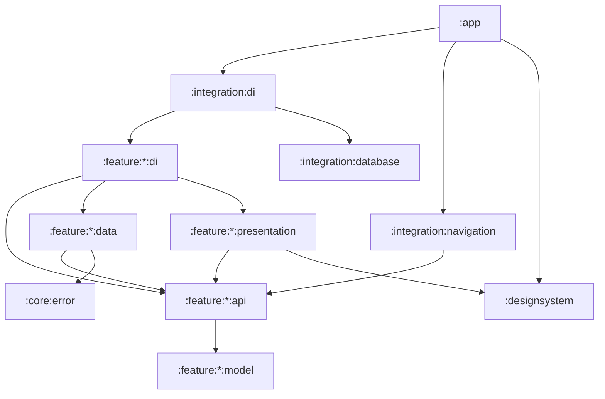

# Android Studio Lite — Architecture (v0.1)

Concise module map for agents and humans. **Source of truth for APIs and models is the code** (`:feature:*:api` / `:model`), not this file. **UI source of truth:** `:designsystem` + Compose (`docs/design-system.md`). Related: `project/progress.md`, `project/requierments.md`, `docs/agents/project-overview.md`.

---

## 1. Product snapshot

On-device Kotlin / Jetpack Compose IDE:

| Capability | v0.1 |
| --- | --- |
| Create / list / open / delete projects (Compose template) | Yes |
| Browse & manage files under project root (sandboxed) | Yes |
| Edit source files (basic editor) | Yes |
| Run → build progress → install APK | Yes (GitHub Actions + APK to Downloads; `FakeBuildService` for tests) |
| Edit → rebuild → reinstall loop | Yes (same product path) |

**Not in v0.1:** Git, AI assistant, syntax highlighting. Optional private sandbox: `#27`.

Foundation: `:designsystem`, `:core:error` (`AppException`).

---

## 2. Goals

1. **Capability modules are self-contained** — each owns data + presentation for its domain.
2. **Public surface is thin** — outside a feature, depend on `:api` (+ `:model` as needed), never `:data` / `:presentation`.
3. **Integration wires only** — no domain logic in `:integration:*` or `:app`.
4. **`:app` stays thin** — Application, Koin start, `IdeNavHost`, permissions, install intents.
5. **Replaceable build backend** — one `BuildService` API; product = GitHub Actions, fake retained for tests.
6. **Safe file sandbox** — file ops stay under the project root.

---

## 3. Module map

```text
app                         # Koin, MainActivity, IdeNavHost host, install permission
designsystem                # tokens + shared Compose primitives
core/error                  # AppException + userMessageOrNull
feature/
  projects/   model · api · data · presentation · di
  files/      model · api · data · presentation · di
  editor/     model · api · data · presentation · di
  buildapk/   model · api · data · presentation · di
  auth/       model · api · data · presentation · di   # session + Connect (login) only
  settings/   api · presentation · di                  # Settings hub + Build account + History entry
  onboarding/ api · data · presentation · di           # first-launch Welcome → Connect / Skip
  github/     api · data · di                          # stateless GitHub helpers (device + build REST)
integration/
  database                  # Room assembly (feature entities/DAOs)
  di                        # aggregates feature + database Koin modules
  navigation                # IdeNavHost — cross-feature routes only
```

Full include list: `settings.gradle.kts`.

| Slice | Owns |
| --- | --- |
| `:model` | Immutable domain types / IDs — facts for callers, not UI layout bags |
| `:api` | Service + `*Screens` interfaces |
| `:data` | Persistence / FS / service impl |
| `:presentation` | Compose UI (+ Screen Context for busy screens); may retain prior domain facts for display |
| `:di` | Feature Koin bindings |

**Provider-shaped UI:** presentation (and feature `:api` / `:model` names) stay **provider-agnostic**. Vendor strings (e.g. “GitHub”) and vendor URIs come from **data** / `:feature:github` via API fields (`providerName`, `providerDisplayName`, `verificationUri`). Do not hardcode a vendor in Compose identifiers (`openGitHubDevicePage`, `onConnectGitHubClick`) or chrome templates — render `"Open $providerName"`, `"Connect $providerDisplayName"`, host from `verificationUri`. Previews and Figma may still show the concrete current provider as fixture copy.

---

## 4. Dependency rules



**Hard rules**

- Outside a feature: **`:api` / `:model` only**.
- `:integration:navigation` only wires **cross-feature** exits; feature-internal routes stay in each feature’s `*Screens`.
- Navigation state is **not** cold-started on every Activity recreate: persist routes with `rememberSaveable` + kotlinx.serialization JSON (`IdeRouteSaver`), not plain `remember`. Deep links carry the project fields destinations need (name, root path, package) so the nav host does not fetch `Project` to render. Route payloads use serializable primitives (project id as `String`) — wrap into domain types (`ProjectId`, etc.) only at feature API boundaries.
- `:editor:data` may depend on `:files:api` (document load/save through the file explorer).
- No feature → feature `:data` / `:presentation` edges.

---

## 5. Features (roles, not APIs)

### Projects
- Metadata in Room; project trees under app-private storage; scaffolds an empty Compose template.
- UI: list ↔ create (internal nav).
- Exits: open → Files; run → Build (can skip Files/Editor).

### Files
- Sandboxed FS under project root (`SandboxPaths`).
- UI: file browser (Screen Context).
- Exits: open file → Editor; run → Build; back → Projects.

### Editor
- In-memory session; persist via `:files:api`; auto-save preference.
- UI: editor screen (Screen Context).
- Exits: back → Files; run → Build.

### Build (`buildapk`)
- `BuildService` + `BuildHistoryStore` + `ApkInstaller` in `:api`.
- **Internals:** `BuildJobLogic` owns job lifecycle and depends only on ports it owns (`BuildJobRepository`, `CloudBuildGateway`). Adapters: `RoomBuildJobRepositoryAdapter` ← `BuildJobDao`, `GitHubCloudBuildGatewayAdapter` ← `GitHubClient`. `DefaultBuildService` wires adapters + auth + registers a history-delete hook. `DefaultBuildHistoryStore` observes/deletes rows and notifies `BuildHistoryEventHooks` (no dependency on `BuildService`). Data layout under `:feature:buildapk:data`: `job/` · `room/` · `github/` · `local/` · `service/` · `fake/`. See `project/build-history-prd.md`.
- **Product data:** GitHub Actions — public sandbox `asl-builds-android-studio-lite`, ephemeral release, Actions `workflow_dispatch`, APK download. Resume payload stored as opaque `providerId` + JSON on the job row.
- UI: start → progress; History via `BuildScreens.History` (nested list → progress|detail). On ready, progress/detail call `ApkInstaller`. Leaving progress without Cancel does not cancel; eager resume on process start.
- **Hosts:** Settings / Build / Projects each route to History in their own nav host (Settings = all projects; others pass project id).

### Auth / Settings / Onboarding
- **Auth:** Connect device flow + session (`accessToken` via `auth:api`).
- **Settings:** hub + Build account (connect / log out) + Build history entry (embeds buildapk History).
- **Onboarding:** first-launch Welcome → Connect / Skip; gate in `IdeNavHost`.
- **Cross-feature hooks:** `ProjectEventHooks` + `ProjectEventsListener` in projects `:api`. `DefaultBuildService` injects `ProjectEventHooks` and [addListener]s cancel-on-project-delete when constructed (`createdAtStart`). Not via Koin `getAll()` multi-bind into `ProjectService`. After successful `deleteProject`, hooks notify best-effort; history rows kept.

### GitHub
- Stateless `:feature:github` — device flow + build REST (`HttpGitHubClient`).

Busy-screen layout: `docs/agents/screen-context.md`. Feature conventions: `/structure-feature-code`.

---

## 6. Integration & app shell

| Module | Role |
| --- | --- |
| `:integration:database` | `AslDatabase` — feature entities/DAOs (projects; build jobs when history ships) |
| `:integration:di` | `integrationDiModule` — only module `:app` starts |
| `:integration:navigation` | `IdeNavHost` — Onboarding / Projects / Files / Editor / Build / Settings. Cross-feature `IdeRoute` is `@Serializable` and restored via `IdeRouteSaver` (JSON). Feature sub-routes use `rememberSaveable`. Deep routes carry project fields (no host-side `getProject`). Editor session is closed by the editor feature when its screen leaves composition — not by the nav host. |
| `:app` | `AslApplication`, `MainActivity`, theme bridge, FileProvider / install permission |

```text
Projects
  ├─ open ──► Files ─┬─ open file ──► Editor ──► Build (return Editor)
  │                  └─ run ───────────────────► Build (return Files)
  ├─ overflow ──► History (project)
  └─ run ──────────────────────────────────────► Build (return Projects)
Build ──► Start ─┬─ progress ──► (back exits Build; job keeps running)
                 └─ History (project) ──► progress | detail
Settings ──► History (all projects)
Build (owns ApkInstaller + History) ──► system install UI ; dismiss ──► returnTo
```

---

## 7. Data ownership

| Data | Where |
| --- | --- |
| Project metadata | Room via `:feature:projects:data` |
| Project files | App-private FS; CRUD via `:feature:files:data` |
| Editor buffer | Memory in `:feature:editor:data`; disk via files API |
| Build artifacts | Local cache + Downloads publish in `:feature:buildapk:data` |
| Build job history | Room via `:feature:buildapk:data` (registered on `AslDatabase`) |
| Auth session | SharedPreferences in `:feature:auth:data` (stub device flow) |
| Onboarding completion | SharedPreferences in `:feature:onboarding:data` |
| GitHub OAuth client id | `github.oauth.clientId` in gitignored `local.properties` → `auth:data` `BuildConfig.GITHUB_OAUTH_CLIENT_ID` (see `local.properties.example`) |
| Remote CI | GitHub Actions via `:feature:github` + `GitHubActionsBuildService` (`#25`) |

### `local.properties` → `BuildConfig`

`:feature:auth:data/build.gradle.kts` reads `github.oauth.clientId` from the root `local.properties` into `BuildConfig.GITHUB_OAUTH_CLIENT_ID`. After changing that script (or any Gradle/app code), **compile/sync the affected modules** before finishing — see `AGENTS.md` (*User correction = system error*: verify generally, don’t rely on one-off bans).

---

## 8. Out of scope / later

Git, AI assistant, syntax highlighting, optional private sandbox (`#27`), Documents storage, Gradle wrappers in generated projects. Build-history notifications / on-screen filter are deferred (`build-history-prd.md`).

Locked product decisions: `project/v0.1-implementation-plan.md` (and grilling notes under `project/` when relevant).

---

## 9. Summary

| Area | Public surface | Impl notes |
| --- | --- | --- |
| Projects | `:feature:projects:api` | Room + template FS; `ProjectEventHooks` (runtime listeners) |
| Files | `:feature:files:api` | Sandboxed FS |
| Editor | `:feature:editor:api` | Session + files API |
| Build | `:feature:buildapk:api` | GHA runner + Room history; `BuildService` + `BuildHistoryStore` |
| Auth | `:feature:auth:api` | Session + Connect (login) only |
| Settings | `:feature:settings:api` | Settings hub; Build account; embeds Build history |
| Nav / DI / DB | `:integration:*` | Wire only |
| UI kit / errors | `:designsystem`, `:core:error` | Shared |
